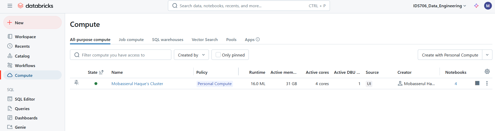
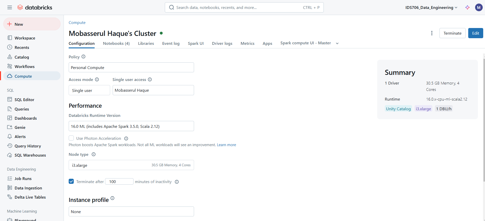
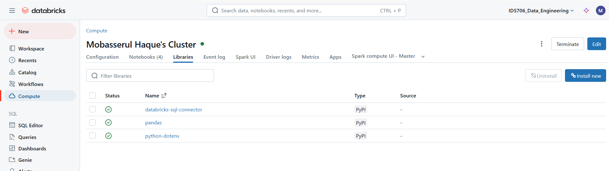
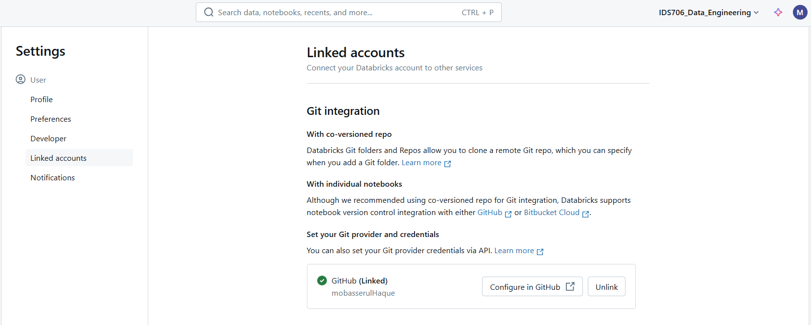
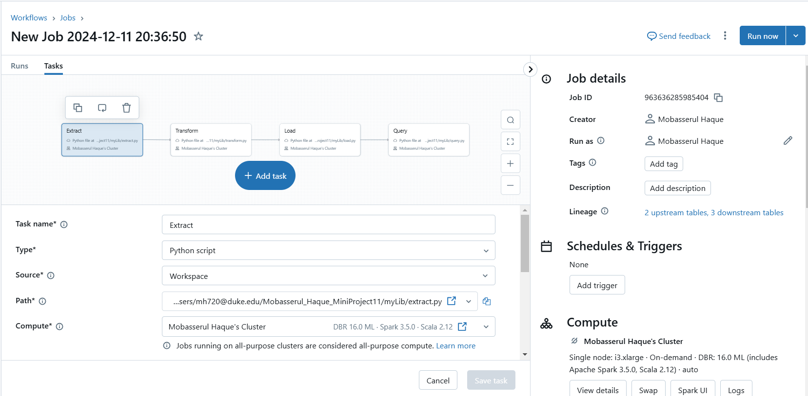
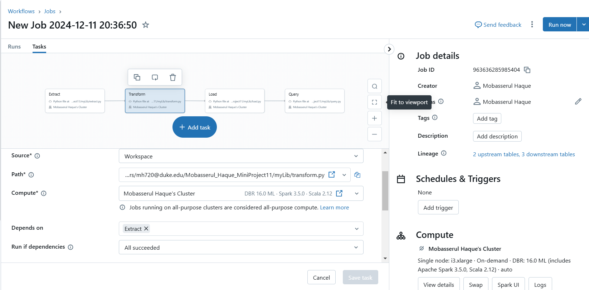
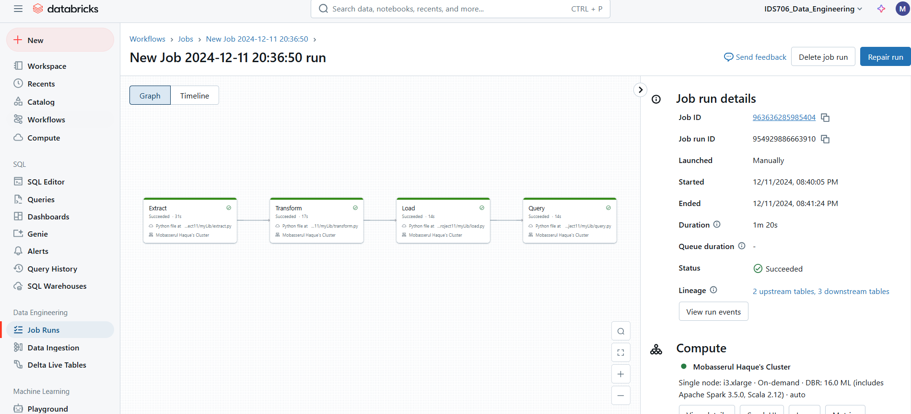
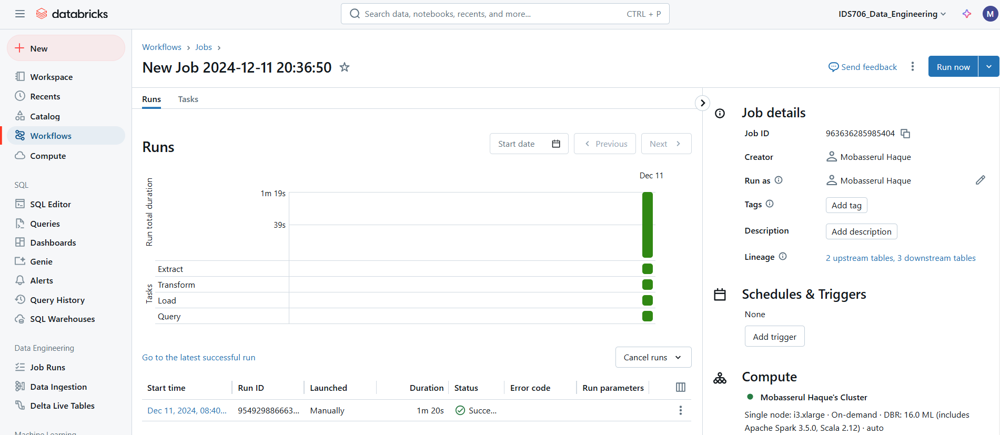

[](https://github.com/nogibjj/Mobasserul_Haque_MiniProject11/actions/workflows/cicd.yml)

# Data Pipeline with Databricks

This project implements a robust ETL (Extract, Transform, Load) pipeline for processing airline safety data. Using Databricks and Python, the pipeline demonstrates a modular design that separates each ETL step into dedicated scripts. 

The pipeline integrates seamlessly with Databricks File Store (DBFS), providing a scalable and efficient environment for data processing. The data is transformed and stored using Delta tables, ensuring high performance for querying and analysis. Additionally, the project leverages PySpark, a Python API for Apache Spark, to handle large-scale data transformations and computations efficiently.

## Project Overview:

### Extraction
The pipeline fetches raw airline safety data from a remote CSV file. PySpark's integration ensures that the data is loaded and cleaned effectively, converting it into a Spark DataFrame for further processing.

### Transformation
Using PySpark SQL and DataFrame operations, the pipeline performs complex transformations such as calculating totals for incidents and fatalities across different periods. PySpark ensures these transformations are distributed, making the process highly scalable and performant.

### Loading
The transformed data is saved into Delta tables, leveraging Databricks' support for Delta Lake to provide ACID transactions and efficient querying capabilities.

### Querying
The final stage involves filtering and querying specific columns of interest. PySpark SQL enables seamless querying of Delta tables, supporting interactive data exploration and downstream analytics.

## Dataset

The dataset contains information about incidents, accidents, and fatalities for major airlines over two periods:
- **1985-1999**
- **2000-2014**

It is sourced from FiveThirtyEight's Airline Safety Dataset.

## Directory Structure

```
├── .devcontainer
│   ├── devcontainer.json
│   └── Dockerfile
├── .github
│   └── workflows
│       └── cicd.yml
├── data
│   └── airline-safety.csv
├── mylib
│   ├── __init__.py
│   ├── extract.py
│   ├── load.py
│   ├── query.py
│   └── transform.py
├── .coverage
├── .env
├── .gitignore
├── Compute_Cluster_Config.PNG
├── Compute_Cluster_Libraries.PNG
├── Compute_Cluster.PNG
├── Job_Runs_ETL_Workflow.PNG
├── Job_Runs_ETL_Workflow1.PNG
├── main.py
├── Makefile
├── query_log.md
├── README.md
├── requirements.txt
└── test_main.py
```
## Features

- **ETL Pipeline**: Implements a distributed ETL pipeline using PySpark for large-scale data processing.
- **Modular Design**: Separate Python modules for extraction, transformation, loading, and querying.
- **Delta Tables**: Utilizes Databricks Delta tables for optimized data storage and querying.
- **PySpark Integration**: Handles large datasets using PySpark's distributed processing capabilities, ensuring scalability and efficiency.
- **CI/CD Integration**: Automates testing and linting using GitHub Actions.
- **DBFS Integration**: Supports Databricks File Store for data storage.

## Steps for Data Pipeline Using Databricks

Follow these steps to set up and execute the ETL pipeline on Databricks:

### Step 1: Configure the Cluster
1. Navigate to the **Compute** tab in Databricks.
2. Create a new cluster and Configure the cluster settings as shown:
   - **Databricks Runtime Version**: 16.0 ML (includes Apache Spark 3.5.0, Scala 2.12)
   - **Node Type**: i3.xlarge (30.5 GB Memory, 4 Cores)
   - **Terminate After**: 100 minutes of inactivity.




### Step 2: Install Required Libraries
1. Navigate to the **Libraries** tab under the cluster.
2. Install the following libraries:
   - `databricks-sql-connector`
   - `pandas`
   - `python-dotenv`
3. Refer below for the setup.



### Step 3: Link Databricks to GitHub
1. Go to your **Databricks User Profile** (click your profile icon).
2. Click on **Settings > Git Integration > Linked Accounts**.
3. Select **GitHub** and follow the prompts to authenticate and link your account.




### Step 4: Create and Run the ETL Workflow
1. Navigate to the **Workflows** section in Databricks.
2. Create a new workflow for the ETL pipeline with the following tasks:
   - **Task 1: Extract**
     - **Name**: Extract
     - **Script Path**: Point to `extract.py` in your repository.
     - **Cluster**: Use the cluster configured in Step 1.

    

   - **Task 2: Transform**
     - **Name**: Transform
     - **Script Path**: Point to `transform.py` in your repository.
     - **Cluster**: Use the same cluster.
     - **Depends On**: `Extract`

    

   - **Task 3: Load**
     - **Name**: Load
     - **Script Path**: Point to `load.py` in your repository.
     - **Cluster**: Use the same cluster.
     - **Depends On**: `Transform`
    
    

   - **Task 4: Query**
     - **Name**: Query
     - **Script Path**: Point to `query.py` in your repository.
     - **Cluster**: Use the same cluster.
     - **Depends On**: `Load`

    

3. After adding all tasks, review the dependency graph as shown in below:



### Step 5: Run the Workflow
1. Trigger the workflow and monitor progress.
2. Review task logs and ensure the pipeline runs successfully.



### Step 6: Push Changes to GitHub
1. Save and commit changes in Databricks.
2. Push the updated scripts and workflow configuration to your GitHub repository.

## Usage

### Run the ETL Pipeline

Execute the main script to run the complete ETL pipeline:

```bash
python main.py
```

The pipeline performs the following steps:

1. **Extracts** data from the source and saves it to a Delta table.
2. **Transforms** the data and creates a transformed Delta table.
3. **Filters** the data and saves it as a new Delta table.
4. **Loads** and displays the data, including schema and summary insights.

### Run Tests

To test DBFS path and other configurations, use the test script:

```bash
python test_main.py
```
Run all tests with:

```bash
make test
```
### Lint and Format Code

Check for linting issues:
```bash
make lint
```
Format the code:
```bash
make format
```

## Key Scripts

### `main.py`
- Orchestrates the ETL pipeline.
- Coordinates extraction, transformation, querying, and loading steps.

### `mylib/extract.py`
- Downloads the airline safety dataset.
- Cleans column names and saves the data as a Delta table.

### `mylib/transform.py`
- Performs transformations, including calculating totals for incidents and fatalities.
- Saves the transformed data as a new Delta table and exports it to CSV.

### `mylib/query.py`
- Filters specific columns and saves the results to a new Delta table.

### `mylib/load.py`
- Loads and displays data from a Delta table, including schema and summary statistics.

### `test_main.py`
- Verifies the accessibility of DBFS paths and ensures proper configurations.

## CI/CD Workflow

### Linting
- Ensures code adheres to style guidelines using `ruff`.

### Testing
- Executes unit tests with `pytest`.

### Formatting
- Formats code with `black`.

### Workflow File
- `.github/workflows/cicd.yml` automates the above steps on `push` or `pull_request`.

